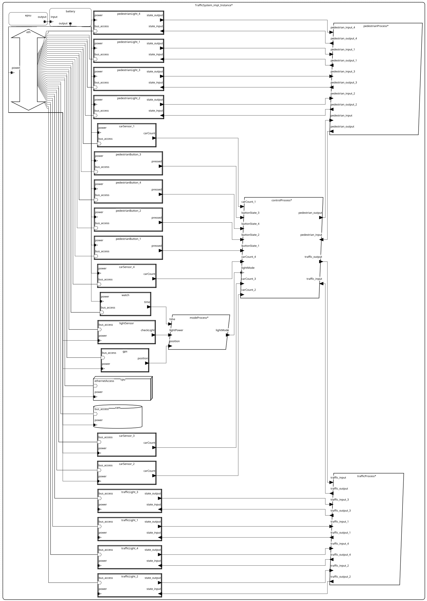
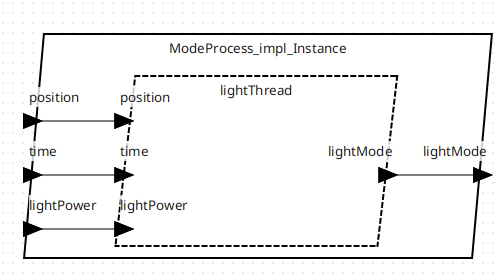
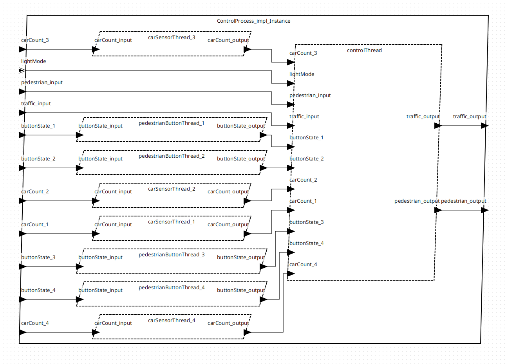
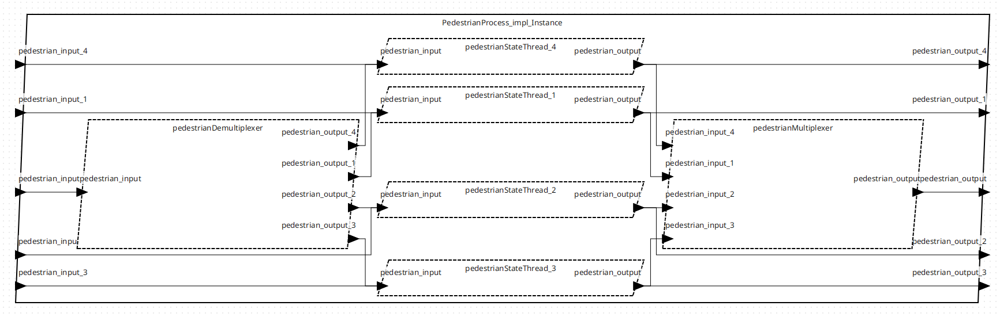
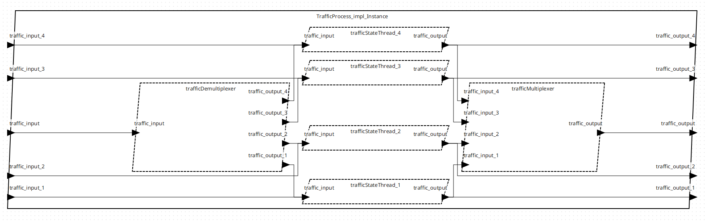

# Traffic-light

## Description

Traffic System manages traffic and pedestrian lights based on data from sensors (car sensors, pedestrian buttons, and a light sensor).
The system operates in different modes (handled by the Mode Process), influenced by time and GPS location.
The Control Process coordinates the interaction between Traffic and Pedestrian Processes and adapts to the changes signalled by the Mode Process.
All the components are powered by the Electric Battery which in turn gets power from the Electrical Power Supply.
All this is managed on a CPU, with data stored in RAM and communication handled via an Ethernet bus.

## Table Of Content
* [Data Types](#Data-Types)
* [Devices](#Devices)
* [Threads](#Threads)
* [Processes](#Processes)
* [System](#System)
* [Diagram](#Diagram)
* [Analysis Report](#Analysis-Report)

## Data Types

#### Abstract Data Types
* `Electricity`: This is an abstract data type with no specific properties.

#### Specific Data Types
* `CarCount`: This is an integer-based data type with a size of 10 bytes. This could potentially be used to represent the number of cars in a specific context.
* `LightPower`: This is an integer-based data type with a size of 10 bytes. It likely represents the power of a light source.
* `ButtonState`: This is a boolean-based data type with a size of 1 bit. This can represent two states, likely for a button - ON/OFF, pressed/unpressed, etc.
* `TrafficLightColor`: An enumerated type with a base of integer and a size of 10 bytes. It has three potential values - "Red", "Yellow", and "Green".
* `PedestrianLightColor`: An enumerated type with a base of integer and a size of 10 bytes. It has two potential values - "Red", and "Green".
* `LightMode`: An enumerated type with a base of integer and a size of 10 bytes. It has two potential values - "Day", and "Night".
* `Position`: A float-based data type with a size of 200 bytes. This data type has two dimensions, likely representing a 2D position (X, Y).
* `Time`: An integer-based data type with a size of 100 bytes. Likely to represent a time value.

#### Array Data Types
* `TrafficLightColorArray`: This is an array type data with a base of 'TrafficLightColor' data type. It has four elements in a single dimension and a size of 40 bytes.
* `PedestrianLightColorArray`: This is an array type data with a base of 'PedestrianLightColor' data type. It has four elements in a single dimension and a size of 40 bytes.

## Devices

#### Bus Type
* `Ethernet`: This bus component handles data transmission between devices. It consumes electricity with a power budget of 0.8 watts and weighs 0.1kg. The bandwidth capacity is 200.0 KBytes per second. Ethernet.impl is the implementation of this bus.

#### Memory Type
* `RAM`: The memory component that requires bus access via the Ethernet bus. It consumes electricity with a power budget of 0.8 watts and weighs 0.05kg. RAM.impl is the implementation of this memory.

#### Device Types
* `CarSensor`: It has an output data port carCount of type CarCount and requires bus access. It consumes electricity with a power budget of 0.8 watts and weighs 0.3kg. It's designed to work periodically with a period of 25ms. There are 4 implementations of this device - impl_1, impl_2, impl_3, and impl_4.
* `PedestrianButton`: It has an output data port pressed of type ButtonState and requires bus access. It consumes electricity with a power budget of 1.2 watts and weighs 0.5kg. It's designed to work periodically with a period of 25ms. There are 4 implementations of this device - impl_1, impl_2, impl_3, and impl_4.
* `PedestrianLight`: This device has input and output data ports of type PedestrianLightColor and requires bus access. It consumes electricity with a power budget of 10.0 watts and weighs 20.0kg. It's designed to work periodically with a period of 25ms. There are 4 implementations of this device - impl_1, impl_2, impl_3, and impl_4.
* `LightSensor`: This device has an output data port checkLight of type LightPower and requires bus access. It consumes electricity with a power budget of 0.5 watts and weighs 0.5kg. It's designed to work periodically with a period of 25ms. LightSensor.impl is the implementation of this device.
* `TrafficLight`: This device has input and output data ports of type TrafficLightColor and requires bus access. It consumes electricity with a power budget of 14.7 watts and weighs 30.5kg. It's designed to work periodically with a period of 25ms. There are 4 implementations of this device - impl_1, impl_2, impl_3, and impl_4.
* `Watch`: It has an output data port time of type Time and requires bus access. It consumes electricity with a power budget of 0.2 watts and weighs 0.2kg. It's designed to work periodically with a period of 25ms. Watch.impl is the implementation of this device.
* `GPS`: It has an output data port position of type Position and requires bus access. It consumes electricity with a power budget of 1.4 watts and weighs 0.1kg. It's designed to work periodically with a period of 25ms. GPS.impl is the implementation of this device.

## Threads
* `CarSensorThread`: This thread takes the car count as an input (in data port carCount_input) and produces an output (out data port carCount_output). The thread has four different implementations impl_1, impl_2, impl_3, and impl_4.
* `PedestrianButtonThread`: This thread receives the state of a button, presumably a pedestrian crossing button, as an input (in data port buttonState_input) and produces an output (out data port buttonState_output). This thread also has four different implementations.
* `LightThread`: This thread receives light power, time, and position as inputs and controls the mode of the light.
* `PedestrianStateThread`: This thread is responsible for managing the state of pedestrian lights, taking in a color input and outputting a color. It has four implementations as well.
* `TrafficStateThread`: This thread manages the state of traffic lights, similar to the PedestrianStateThread.
* `ControlThread`: This thread appears to be the main control thread for the traffic management system. It takes in multiple inputs including the states of pedestrian lights, traffic lights, car counts, button states, and the light mode, and produces outputs for pedestrian and traffic light colors.
* `TrafficMultiplexer` and `TrafficDemultiplexer`: These threads are responsible for combining and separating the input/output traffic light color signals respectively.
* `PedestrianMultiplexer` and `PedestrianDemultiplexer`: Similar to the traffic multiplexer and demultiplexer, these threads combine and separate the input/output pedestrian light color signals respectively.

#### Each thread is characterized by a few properties:

* `SEI::MIPSBudget`: Indicates the processing power (in MIPS, millions of instructions per second) allocated for the thread.
* `Stack_Size`: The amount of stack memory allocated for the thread.
* `Data_size`: The amount of data memory allocated for the thread.
* `Period`: The time interval at which the thread is expected to run.
* `Compute_Execution_Time`: The expected computation time range for the thread to complete its tasks.

## Processes`

* `CPU`: This processor definition has several features including ethernetAccess, which requires bus access to Devices::ethernet, and power, which takes in Data_Types::Electricity. Properties like power budget, MIPS (Million Instructions Per Second) capacity, and weight are also specified.
* `ControlProcess`: This process manages traffic and pedestrian light controls. It has multiple input and output data ports for receiving and sending signals related to traffic lights, pedestrian lights, button states, car counts, and light modes. An implementation is given that includes various threads for processing signals and controlling the lights.
* `ModeProcess`: This process controls the lighting mode. It has input ports for light power, time, and position and an output port for light mode. The implementation contains a thread to process these inputs and determine the lighting mode.
* `TrafficProcess`: This process controls the traffic lights. It has input and output data ports for individual traffic lights and arrays of traffic lights. The implementation includes threads for managing individual traffic light states and multiplexing/demultiplexing these states into/from an array format.
* `PedestrianProcess`: Similar to TrafficProcess, this process controls the pedestrian lights. It has similar input and output ports and also includes threads for managing individual pedestrian light states and multiplexing/demultiplexing these states.

The defined processes (`ControlProcess`, `ModeProcess`, `TrafficProcess`, `PedestrianProcess`) collectively represent the system architecture for
a traffic management system, and the CPU is the processor on which these processes run. Each process is implemented through threads that perform specific tasks,
and connections are established between these threads and their corresponding input/output ports to control traffic and pedestrian lights.

## System

* `ElectricalPowerSupply`: This is a system that provides electricity. It has an output feature that supplies electricity, with a gross weight of 1.2kg and a power supply of 100.0W.
* `ElectricBattery`: A system with an input and output feature for electricity. It has a gross weight of 0.9kg and a power capacity of 20.0KW.
* `TrafficSystem`: The primary system under consideration. It has properties such as MIPSCapacity (5000.0 mips), NetWeight (0.35kg), and a WeightLimit (250.0kg).
* `TrafficSystem.impl`: This is the implementation of the traffic system. It contains the following subcomponents:
- Power supply units (epsu and battery)
- Processor (cpu), memory (ram), and bus (eth)
- Sensors and buttons (carSensor_n, pedestrianButton_n, lightSensor, gps, watch)
- Lights (pedestrianLight_n and trafficLight_n)
- Traffic and pedestrian processes (trafficProcess, pedestrianProcess, modeProcess, controlProcess)
- Connections: It defines how these components are interconnected.
- Power supply connections (psupply, p1 to p18) which distribute the power from the battery to all the components
- Ethernet connections (e1 to e21) which facilitate data exchange between components through the eth bus
- Port connections (c1 to c32) which connect the output and input ports of various devices and processes
- Properties: The implementation also defines various bindings which specify how the components are physically interconnected. It defines the binding of processors (Actual_Processor_Binding) and memory (Actual_Memory_Binding) to various devices and processes, and the binding of the Ethernet bus (Actual_Connection_Binding) to various connections.

## Diagram

    
    
    
    
    

## Analysis Report

1. Not Bound Resource Budget Analysis Report

The report provides a breakdown of the budgeted and actual MIPS (Million Instructions Per Second) use by various components within the system. Here are some key takeaways from the report:
* **System Over Capacity**: The total capacity of the system is 144.400 MIPS, which is significantly less than the total budgeted MIPS usage of 938.600 MIPS. This means that the system is currently over capacity.
* **Components Usage**: Various components of the system including devices, threads, and processes are listed with their budgeted and actual MIPS usage. Most of the devices such as car sensors, pedestrian buttons, and lights have no MIPS usage. On the other hand, threads and processes within the Traffic System and the Control Process consume significant MIPS.
* **Threads and Processes**: The threads and processes which are part of the Traffic Process, Pedestrian Process, Mode Process, and Control Process all consume MIPS. However, they all operate below their budgeted MIPS, showing some degree of efficiency. The highest slack (difference between budgeted and actual MIPS) is found in the controlThread of the Control Process, operating at 89.6% below its budget.
* **Efficiency**: Every thread and process listed is operating below its budgeted MIPS, showing that these components are efficiently using their allocated resources. The percentage slack listed for each thread and process indicates how much below budget they are operating.

In conclusion, while the system is over its total capacity, the individual components are working efficiently and staying within their allocated budgets. The discrepancy between the total system capacity and total budgeted MIPS indicates a need for better resource allocation or an increase in total system capacity.

2. Power Analysis Report

This report analyzes the computing electrical power for a system's battery. It considers the battery's capacity, power supply, and the power budget for various components. Here's a summary of the report:
* **Battery Capacity**: The total power capacity of the battery is 20000.0 Watts (W).
* **Power Supply**: The power supply to the battery is 100.0 W, which is sourced entirely from the epsu (an acronym commonly used for Emergency Power Supply Unit).
* **Power Budget**: The total power budget, i.e., the sum of the power allocated for various components, is 52.5 W. Each component's power usage is listed, which includes several hardware components like cpu, eth, ram, and various devices like car sensors, pedestrian buttons, pedestrian lights, light sensor, watch, and gps. The power usage for these components varies, ranging from 800 milliwatts (mW) for car sensors to 10 W for pedestrian lights.
* **Within Capacity and Supply**: The total power budget of 52.5 W is well within the battery's total capacity of 20000.0 W and the supplied power of 100.0 W. This means that the system is operating efficiently without exceeding the power supply or the battery's capacity.

In conclusion, the system is well-balanced in terms of power usage. The power budget for each component is maintained within the total power supply, ensuring that the system can operate efficiently without overloading the battery. The large difference between the battery capacity and the total power budget suggests that there's room for scaling up operations or adding more components if required.

3. Weight Analysis Report

This report details the weight of various components in a traffic system, and the overall weight, in relation to a specified weight limit. Here's a summary of the details provided:
* **Individual Components**: Various hardware components and devices such as ethernet (eth), car sensors, pedestrian buttons and lights, traffic lights, light sensor, watch, gps, ram, cpu, Emergency Power Supply Unit (epsu), and battery are listed with their respective weights. The weight for these components varies, with the lightest components (like the cpu and ram) weighing 0.050 kg and the heaviest components (the traffic lights) weighing 30.500 kg.
* **No Individual Weight Limit Specified**: For each component, no specific weight limit is given. This suggests that there are no weight constraints for the individual components, and the focus is instead on the total system weight.
* **Total System Weight**: The total weight of all components combined is 208.650 kg.
* **System Weight Limit**: The weight limit for the entire system (TrafficSystem_impl_Instance) is given as 250.000 kg.
* **Weight Slack**: The total system weight is under this limit by a margin of 16.5%, which is referred to as "weight slack". This slack indicates that the system has some leeway to add more components or increase the weight of existing components without exceeding the overall weight limit.

In conclusion, the report indicates that the weight of the system is well managed. It is within the specified limit, leaving a significant weight slack for potential adjustments or additions. The lack of individual weight limits for components offers flexibility in the system design, but it also implies that the overall system weight needs to be monitored to ensure it stays within the limit.